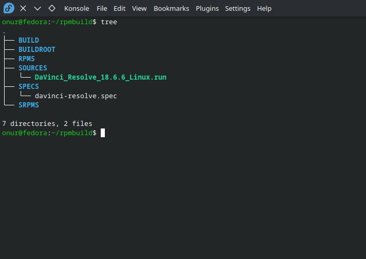

# Building DaVinci Resolve RPM Package on Fedora

This guide provides a step-by-step process to build and install an RPM package for DaVinci Resolve on Fedora.

## Step 1: Install Required Dependencies

First, you need to install the necessary dependencies for building the RPM package. Open your terminal and run the following command:

```bash
sudo dnf install rpm-build apr-util apr-util.i686 libcxx libcxx.i686 patchelf libxcrypt-compat
```

## Step 2: Clone the Repository
```bash
git clone -b master https://github.com/onurbbr/fedora-davinci-resolve-rpm.git ~/rpmbuild
```

## Step 3: Create some folders for building
```bash
cd ~/rpmbuild
mkdir BUILD BUILDROOT RPMS SOURCES SRPMS
```

## Step 4: Download and Copy the DaVinci Resolve File
Download and extract the DaVinci Resolve .zip file (version 18.6.6 is used here). Then copy the .run file to the SOURCES directory in the cloned repository
```bash
cp ~/Downloads/DaVinci_Resolve_18.6.6_Linux.run ~/rpmbuild/SOURCES
```

## Step 5: Check the location of the files before starting the installation.
The file locations need to be as follows:



## Step 6: Start the Packaging Process
Finally, start the RPM packaging process by running the following command:
```bash
QA_RPATHS=$(( 0x0001|0x0002|0x0004|0x0008|0x0010|0x0020 )) rpmbuild -bb ~/rpmbuild/SPECS/davinci-resolve.spec
```

# Warnings:
1- Since I could not fully understand Fedora's rpath control, I bypassed Fedora's rpath control with QA_PATHS and did the rpath operations manually with patchelf. So, ignore the warnings that appear on the screen during the package compilation, no problem.

2- If you think there is a new version, you can let me know from the "Issues" section, or you can manually find the file with the spec extension and change the version information and file name manually.

3- If you encounter an error while compiling, please create a "New Issue" from the "Issues" section along with your log file.

# Notes:
1- The rpath check is skipped here because the spec file already includes the commands needed to handle this. There is no problem in installing, updating and uninstalling the program.

2- The reason I installed it as Native is that it is easy to install, update and uninstall. I resorted to this method because I was tired of updating manually.

